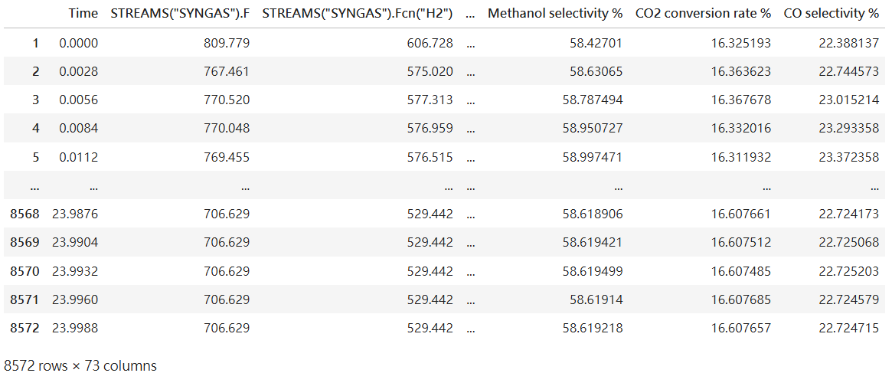

# Methanol-synthesis-optimization
Using artificial neural network to optimize the methanol synthesis process. 

First of all, I have calculated the target parameter (Methanol selectivity, CO2 conversion rate, CO selectivity) 
based on the mole-flow fraction from reactor's input and output in a real methanol synthesis reactor.

According to the methanol reaction equation and related formula
 1.  x1 CO2 + 3H2 <--> CH3OH +H2O (main reaction)
 2.  x2 CO + 2H2 <--> CH3OH
 3.  x3 CO2 + H2 <--> CO + H2O (side reaction)

Example: 
[Target parameter calculation.py](Targetparametercalculation.py) 
Outcome: 

